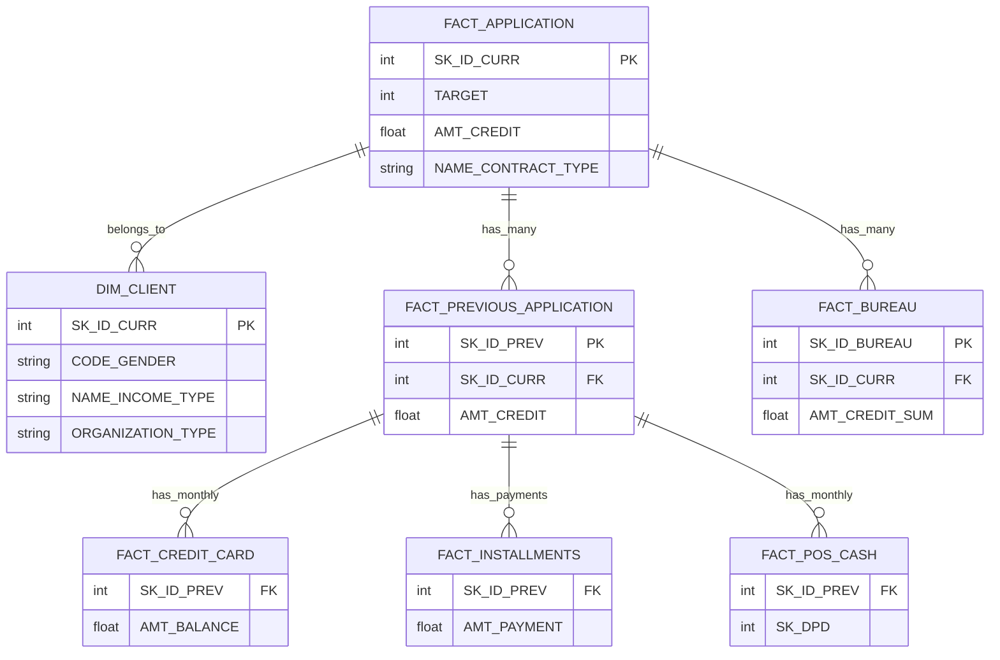
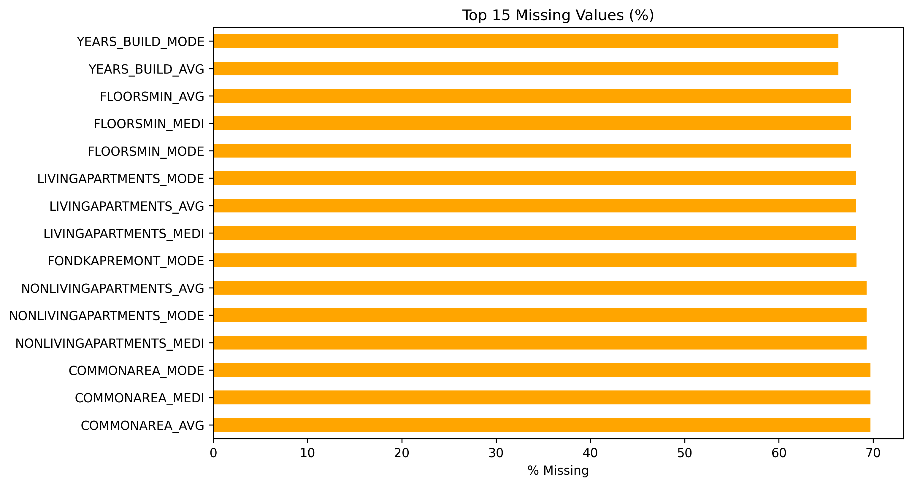
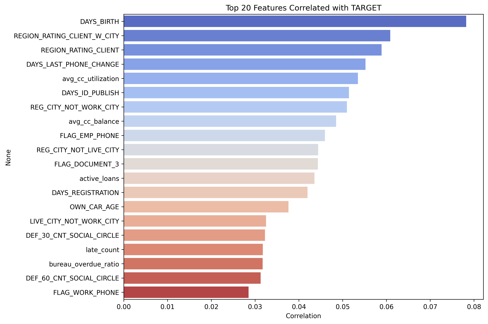
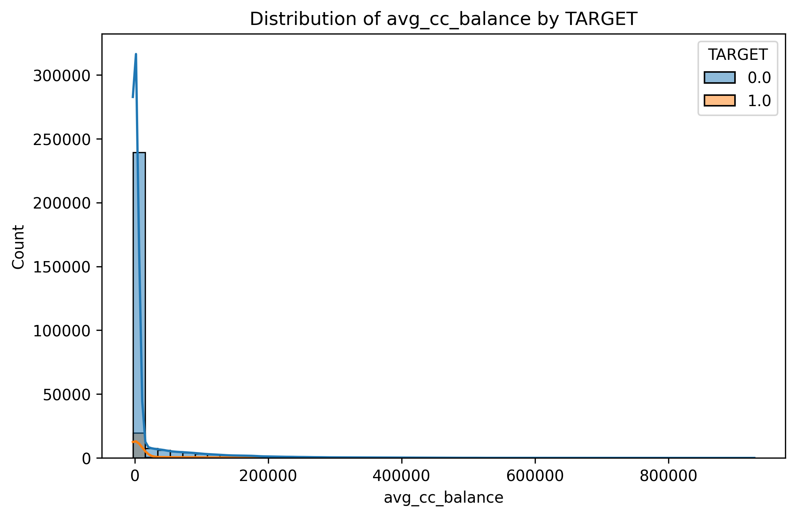
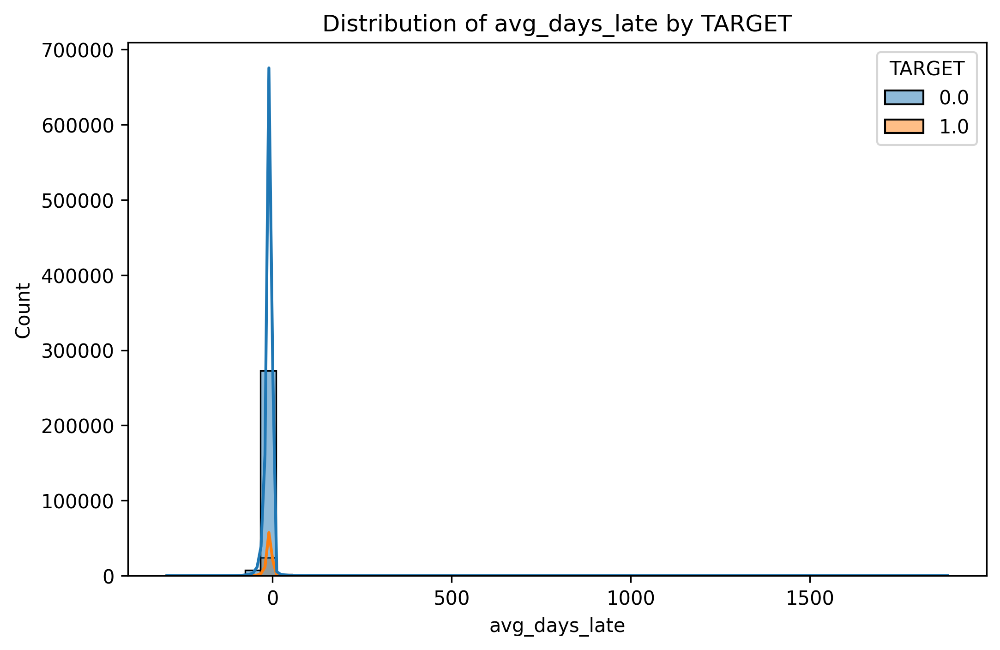
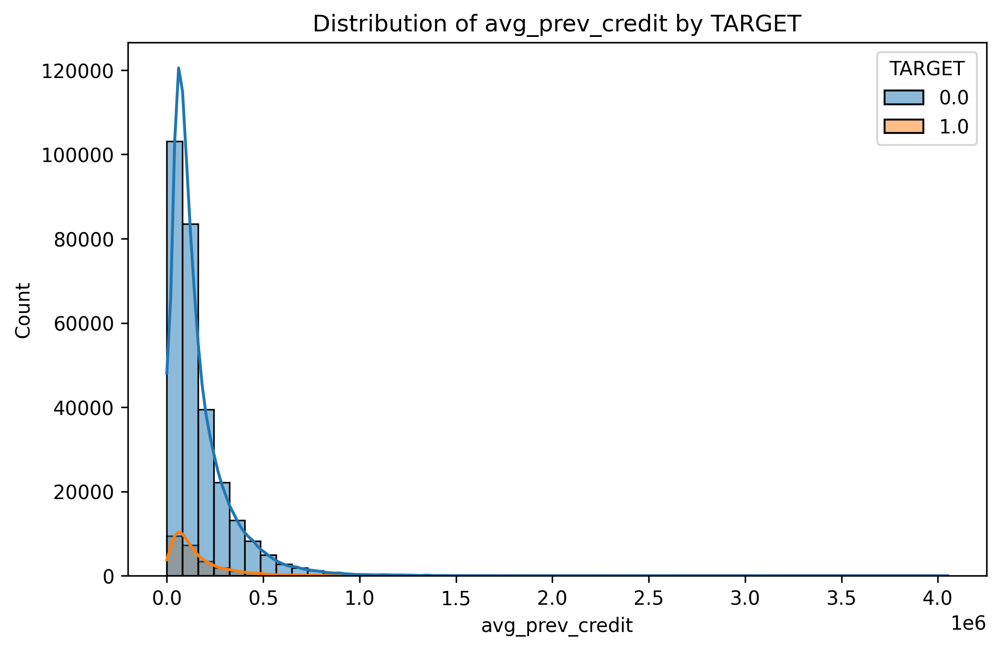
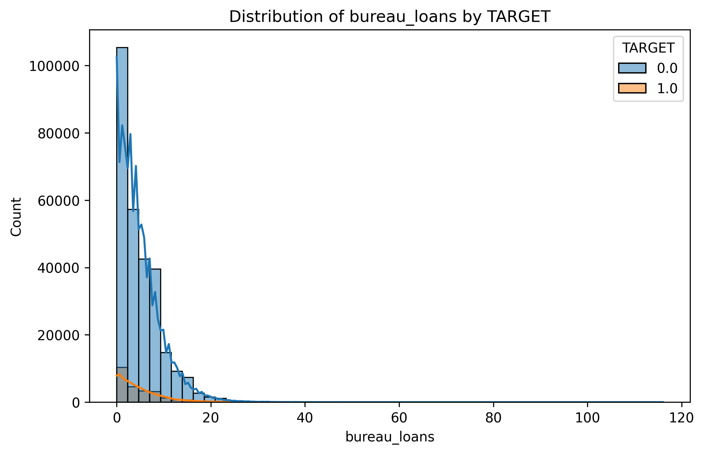
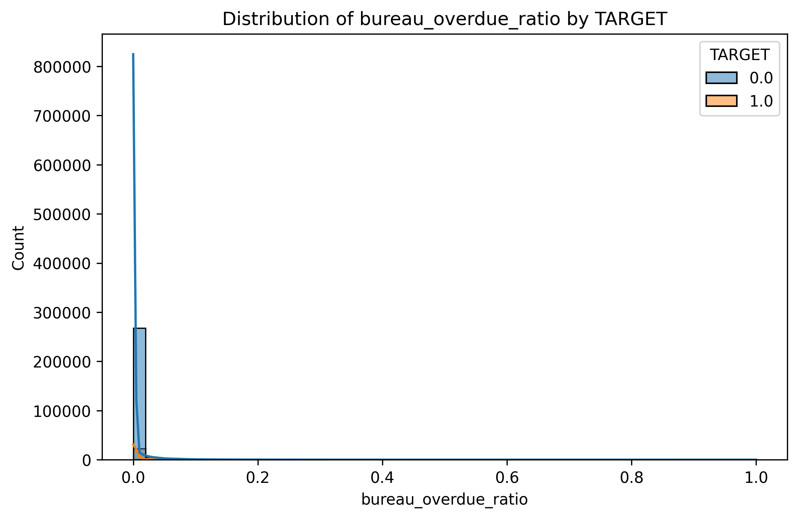
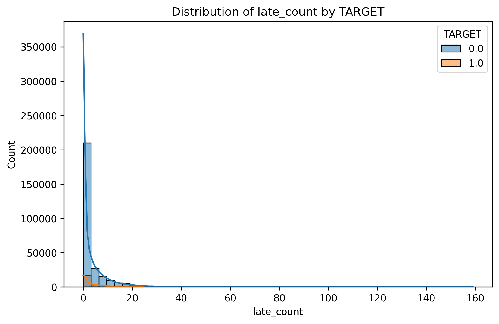
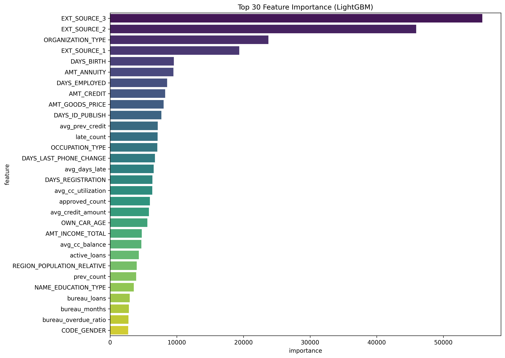

# Home Credit Default Risk - End-to-End Data Warehouse + Predictive Model

**Full End-to-End Pipeline**: Collect → Data Warehouse → Feature Engineering → EDA → Modeling → Deployment

---

### 📊 Project Overview
Built a complete **Star Schema Data Warehouse** on the famous Home Credit Default Risk dataset (2.5 GB, 10 relational CSV files).  
Performed advanced feature engineering with **50+ client-level aggregations**, comprehensive EDA, and trained a **LightGBM model** achieving:

- **Validation AUC**: **0.76889**
- **Kaggle Public Score**: **0.75883**
- **Kaggle Private Score**: **0.75608**

---

### 🏗️ Data Warehouse Schema (Star Schema)

Star Schema Design: Central fact_application table connected to one dimension table and multiple historical fact tables for rich behavioral features.

🛠️ Tech Stack

Data Warehouse: DuckDB (Star Schema + Views)
ETL & Aggregations: Python + SQL
EDA & Visualization: Pandas, Matplotlib, Seaborn
Modeling: LightGBM

📁 Project Structure
texthome_credit_dw_project/
├── database/                  # home_credit_dw.duckdb (0.87 GB)
├── data/raw/                  # Original 10 CSVs
├── scripts/
│   ├── etl/load_to_duckdb.py
│   ├── features/aggregations.py
│   ├── eda/eda_analysis.py
│   └── model/train_lightgbm.py + submission.py
├── reports/figures/           # All plots
├── models/                    # lightgbm_default_risk.txt
├── reports/                   # final_report.md + submission.csv
└── README.md

📈 Exploratory Data Analysis

Top Missing Values

Top Correlations with TARGET

Key Feature Distributions

Feature Importance (LightGBM)

🎯 Model Results

Validation AUC: 0.76889
Kaggle Public Score: 0.75883
Top Features: EXT_SOURCE_3, EXT_SOURCE_2, ORGANIZATION_TYPE, DAYS_BIRTH, late_count, bureau_overdue_ratio

🚀 How to Reproduce
Bashgit clone https://github.com/zainabHashem/home-credit-dw-predictive-model.git
cd home-credit-dw-predictive-model
pip install -r requirements.txt
# Put the 10 CSVs in data/raw/
python scripts/etl/load_to_duckdb.py
python scripts/features/aggregations.py
python scripts/model/train_lightgbm.py
python scripts/model/submission.py

📋 Portfolio Highlights

Designed & implemented Star Schema Data Warehouse on 2.5 GB relational dataset (27M+ rows)
Built 50+ client-level aggregations from 6 fact tables
Achieved Kaggle Public AUC 0.75883 with LightGBM
Complete end-to-end automated pipeline

Made with ❤️ by Zainab Hashem
March 2026
